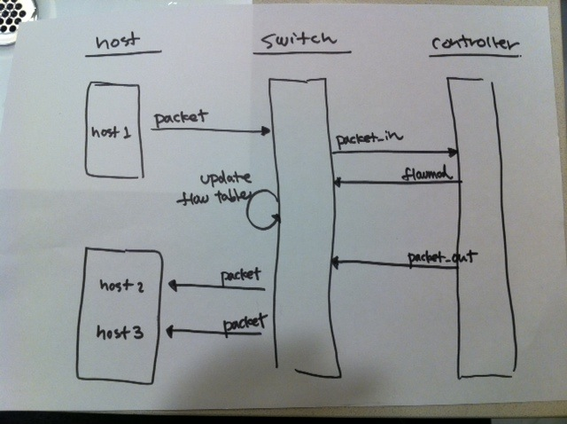

!SLIDE master
# リピータハブのデザイン ############################################

!SLIDE full-page-image

!SLIDE bullets small incremental
# 分析 ######################################################

* 動作テストにはスイッチ 1 台と最低ホスト 3 台が必要
* → どうやって、テスト環境を構築する？

* リピータハブのような単純な機能でも、シーケンスはわりと複雑
* → どうやって、それぞれの矢印をテストする？

!SLIDE bullets small incremental
# Trema フレームワーク ###########################################

* <b>ネットワーク DSL</b>
* 開発マシン上にエミュレーション環境を作れる
* この上で開発した物はそのまま実環境へもデプロイ可能

* <b>テストフレームワーク</b>
* シーケンスの矢印が正しく動いているかユニットテストとして記述

* <b>Trema Ruby ライブラリ</b>
* DSL やテスト、コントローラをシームレスに簡潔に記述

!SLIDE
# へえ。。。
## オレもそろそろ 34 だし
## Trema とやらをはじめてみるか。。。
