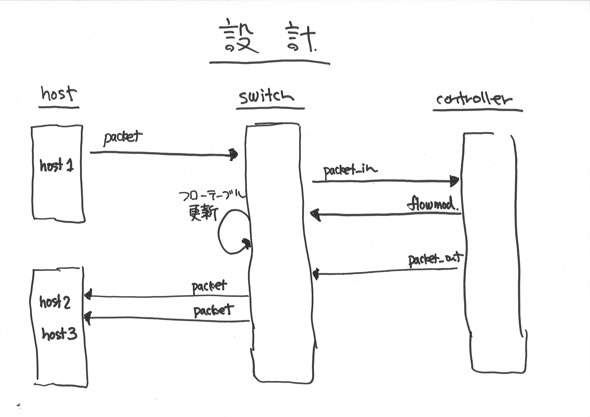

!SLIDE master bullets
# Design phase #################################################################

* The theme for this tutorial is "repeater-hub"
* We are going to explore the Trema framework by designing, testing and debugging the repeater-hub program.

!SLIDE full-page-image

!SLIDE bullets small
# Analysis #####################################################################

* In order to test repeater-hub program, we need one switch and at least three hosts
* => How can we build such a test environment? 

* The sequence looks surprisingly complex despite the simplicity of repeater-hub functionality (== flooding)
* => How can we test each arrow in the diagram?

!SLIDE bullets small
# Trema framework ##############################################################

* <b>Network DSL</b>
* Build emulation envrionment in your laptop

* <b>Test framework</b>
* Describe and run unittests of each arrow in execution sequence

* <b>Trema Ruby library</b>
* Write human-readable DSL and tests briefly and seamlessly

!SLIDE full-page-image

