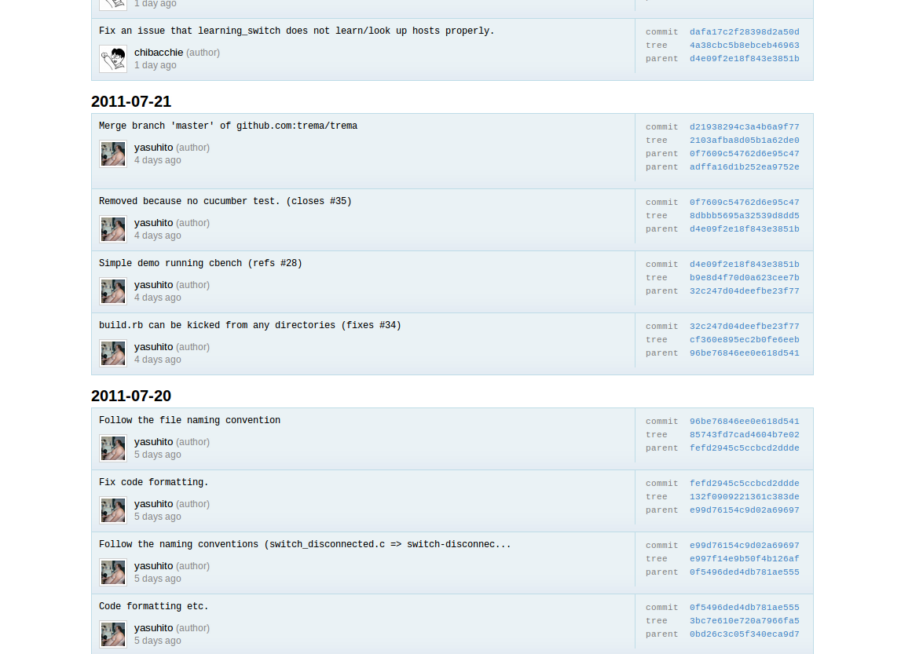
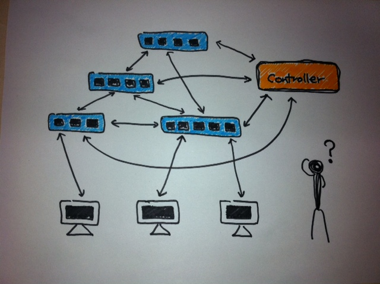
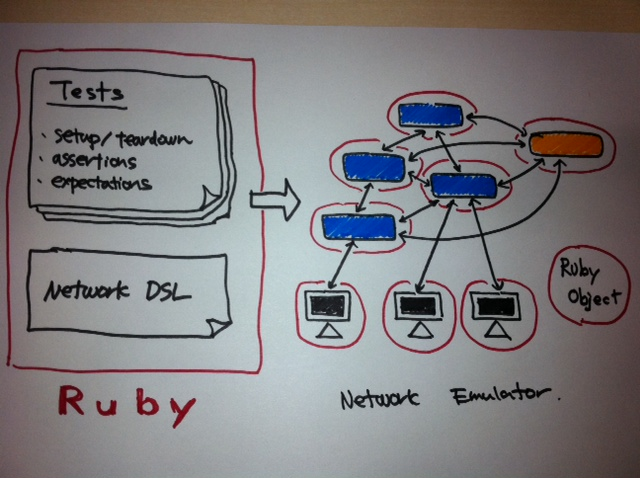

!SLIDE center
# Trema チュートリアル ##############################################################

## Yasuhito Takamiya
## @yasuhito

 

## 6/9/2011

 
 

!SLIDE center
# Trema チュートリアル ##############################################################

## Yasuhito Takamiya
## @yasuhito

 

## 6/9/2011

 
 

!SLIDE full-page-image

!SLIDE full-page-image

!SLIDE bullets incremental small
# 自己紹介: 過去のプロジェクト #########################################################

* クラスタ (Presto series @ 東工大)
* グリッド (InTrigger @ 東大、京大、早稲田、慶應 etc.)
* スパコン (TSUBAME 1 @ 東工大)
* Parakeet (distributed checkpointing of MPI)
* Dolly+ (disk network cloning tool)
* Lucie (cluster network installer)
* BareMetalCloud (PaaS without virtualization)

!SLIDE bullets incremental small
# 今日のゴール ####################################################################

## - リピータハブを作りながら Trema フレームワークを紹介 -

* Trema での開発の進めかた
* テストやデバッグの方法
* アーキテクチャとデザイン
* <b>NOX や Beacon とどこが違うか？ を重点的に説明</b>

!SLIDE
# Why Trema? ###################################################################

!SLIDE bullets small
# OpenFlow 開発の大変さ ###########################################################

* そもそも実行環境を作るのが大変
* たくさんのスイッチ、ホスト、ケーブルをセットアップ
* → 開発マシン一台でできないか？ (e.g., mininet)
* → Trema も mininet に似たエミュレーション環境を提供

!SLIDE bullets small
# Network エミュレーション ############################################################

* 仮想実行環境を開発マシンの一台の上に構築可能
* 仮想スイッチ: Open vSwitch
* 仮想ホスト: phost (pseudo host)
* 仮想リンク: vlink (ip command)
* Ruby による言語内 DSL で記述可能

!SLIDE bullets small
# Network DSL ##################################################################

	@@@ ruby
	# 仮想スイッチ
	vswitch("switch1") { datapath_id "0x1" }
	vswitch("switch2") { datapath_id "0x2" }
	vswitch("switch3") { datapath_id "0x3" }
	vswitch("switch4") { datapath_id "0x4" }

	# 仮想ホスト
	vhost("host1")
	vhost("host2")
	vhost("host3")
	vhost("host4")
	
	# 仮想リンク
	link "switch1", "host1"
	link "switch2", "host2"
	link "switch3", "host3"
	link "switch4", "host4"
	link "switch1", "switch2"
	link "switch2", "switch3"
	link "switch3", "switch4"

!SLIDE small
# OpenFlow == 分散プログラミング #####################################################

!SLIDE full-page-image

!SLIDE bullets small incremental
# OpenFlow == 分散プログラミング #####################################################

* たくさんのスイッチ、ホスト、リンク
* それぞれがステート (フローテーブル、統計情報 etc.) を持ち、
* それぞれの間で複雑な通信が起こる分散プログラミング
* <b>→ テスト無しでは開発が大変</b>

!SLIDE small
# Trema テストフレームワーク ###########################################################

!SLIDE full-page-image

!SLIDE bullets small
# テストフレームワーク (Ruby only) #####################################################

* ネットワーク構成とコントローラのテストを Ruby で記述可能
* ネットワーク環境の setup/teardown
* スイッチやホストのアサーションとエクスペクテーション
* リンクダウン、ノード故障などの fault injection

!SLIDE bullets small
# テストコードの例 ##################################################################

	@@@ ruby
	# テスト例: MyController コントローラのユニットテスト
	# パケットが届くとコントローラの packet_in ハンドラが呼ばれることをテスト
	
	network { # 環境のセットアップ
	  vswitch("switch") { datapath_id "0xabc" }
	
	  vhost("host1")
	  vhost("host2")

	  link "switch", "host1"
	  link "switch", "host2"
	}.run(MyController) { # テストの実行
	  # エクスペクテーション
	  controller.should_receive(:packet_in)
	
	  # テストパケットの送信
	  send_packets "host1", "host2"
	}

!SLIDE bullets small
# 特徴のまとめ #####################################################################

## エミュレータとテストフレームワークを Ruby で統合することにより
## "普通" のユニットテスト技法
## (スタブ、モック、エクスペクテーション etc.)
## を OpenFlow (== 分散プログラミング) に適用できる
