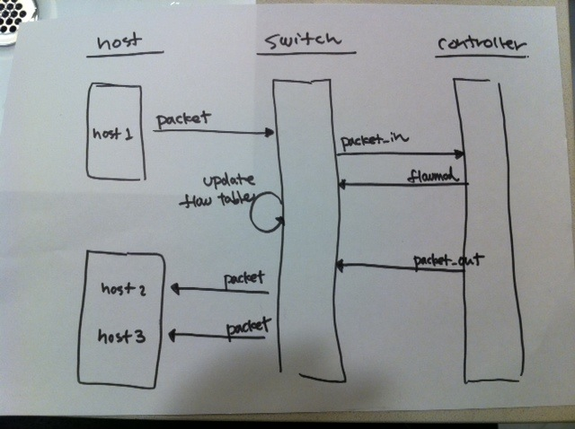

!SLIDE
# イテレーション #2 #############################################################
## "すべてのポートにパケットを送る"

!SLIDE small
# さっそくテスト ################################################################

## あるポートに届いたパケットが他のすべてのポートに送られる

	@@@ ruby
	describe RepeaterHub do
	  # it == RepeaterHub のインスタンス
	  it "should flood incoming packets to every other port"
	end

!SLIDE commandline small
# 実行 ##########################################################################

	@@@ commandline
	$ rspec -fs -c spec/repeater-hub_spec.rb 
	
	RepeaterHub
	  should flood incoming packets to every other port (PENDING: Not Yet Implemented)
	
	Pending:
	  RepeaterHub should flood incoming packets to every other port
	    # Not Yet Implemented
	    # ./spec/repeater-hub_spec.rb:9
	
	Finished in 0.00024 seconds
	1 example, 0 failures, 1 pending
	
	
	=> PENDING (Not Yet Implemented)

!SLIDE bullets small
# It (RSpec) ###################################################################

	@@@ ruby
	describe "Hello Trema" do
	  it 'should be a String' do
	    "Hello Trema".should be_a(String)
	  end

	  it 'should not == "Hello Frinfon"' do
	    "Hello Trema".should_not == "Hello Frinfon"
	  end
	end

	# =>
	#   Hello Trema
	#     should be a String
	#     should not equal to "Hello Frinfon"

* それぞれの it は機能ひとつひとつに対応
* ブロック内に機能のテストを書く

!SLIDE bullets small incremental
# テストの詳細化 ################################################################

* <b>"届いたパケットが他のすべてのポートにも届く"</b>
* ==
* スイッチ 1 台とホストが 3 あったとき (<i>Given</i>)、
* ホスト 1 が ホスト 2 にパケットを送ると (<i>When</i>)、
* ホスト 2 と ホスト 3 にパケットが届く (<i>Then</i>)

!SLIDE small
# Given ########################################################################

	@@@ ruby
	describe RepeaterHub do
	  it "should flood incoming packets to every other port" do
	    network {
	      # スイッチ 1 台
	      vswitch("switch") { dpid "0xabc" }

	      # ホスト 3 台
	      vhost("host1") { promisc "on" }
	      vhost("host2") { promisc "on" }
	      vhost("host3") { promisc "on" }
	
	      # ホストをスイッチにつなぐ
	      link "switch", "host1"
	      link "switch", "host2"
	      link "switch", "host3"
	    }
	  end
	end

!SLIDE small
# ネットワーク DSL ##############################################################

	@@@ ruby
	# 以下に定義するネットワークエミュレーション環境を作る
	network {
	  # 仮想スイッチ
	  vswitch("名前") { オプション }
	
	  # 仮想ホスト
	  vhost("名前") { オプション }
	
	  # 仮想リンク
	  link "ピア#1", "ピア#2"
	}

!SLIDE smaller
# Given, <b>When</b> ###########################################################

	@@@ ruby
	describe RepeaterHub do
	  it "should flood incoming packets to every other port" do
	    network {
	      # ...
	    }.run(RepeaterHub) {
	      # 上に定義したネットワーク上で RepeaterHub を起動
	
	      # host1 から host2 にテストパケットを送る
	      vhost("host1").send_packet "host2"
	    }
	  end
	end

!SLIDE small
# ネットワーク DSL ##############################################################

	@@@ ruby
	network {
	  # ネットワーク定義
	}.run(ControllerClass) {
	  # "When"でやることをここに書く
	  # 
	  # vswitch("名前").メソッド
	  # vhost("名前").メソッド
	  # link("ピア1", "ピア2").メソッド
	}

!SLIDE small
# When の例 ####################################################################

	@@@ ruby
	# host1 から host2 に 1000 個のテストパケットを送信
	vhost("host1").send_packet "host2", :n_pkts => 1000
	
	# host1 から host2 に pps = 10 で 5 秒間テストパケットを送信
	vhost("host1").send_packet "host2", :pps => 10, :duration => 5
	
	# (そのほかのオプションは ./trema help send_packets を参照)
	
	
	# host1 <=> host2 間のリンクをダウン
	link("host1","host2").down
	
	# host1 <=> host2 間のリンクをアップ
	link("host1","host2").up

!SLIDE commandline small
# テスト #######################################################################

	@@@ commandline
	$ rspec -fs -c spec/repeater-hub_spec.rb 
	
	RepeaterHub
	  should flood incoming packets to every other port (FAILED - 1)
	
	Failures:
	
	  1) RepeaterHub should flood incoming packets to every other port
	     Failure/Error: network {
	     RuntimeError:
	       RepeaterHub is not a subclass of Trema::Controller
	     # ./spec/repeater-hub_spec.rb:11
	
	Finished in 0.07034 seconds
	1 example, 1 failure
	
	
	=> FAIL (RepeaterHub is not a subclass of Trema::Controller)

!SLIDE small
# 修正 #########################################################################

	@@@ ruby
	# Trema::Controller クラスを継承	
	class RepeaterHub < Trema::Controller
	end
	

	describe RepeaterHub do
	  it "should flood incoming packets to every other port" do
	    network {
	      # ...
	    }.run(RepeaterHub) {
	      # ...
	    }
	  end
	end
	
	
	#=> SUCCESS

!SLIDE smaller
# Given, When, <b>Then</b> #####################################################

	@@@ ruby
	describe RepeaterHub do
	  it "should flood incoming packets to every other port" do
	    network {
	      # ...
	    }.run(RepeaterHub) {
	      vhost("host1").send_packet "host2"
	
	      # テスト: host2 と host3 がパケットを 1 つずつ受け取るはず
	      vhost("host2").stats(:rx).should have(1).packets
	      vhost("host3").stats(:rx).should have(1).packets
	    }
	  end
	end

!SLIDE commandline small
# テスト ########################################################################

	@@@ commandline
	$ rspec -fs -c spec/repeater-hub_spec.rb 
	
	RepeaterHub
	  should flood incoming packets to every other port (FAILED - 1)
	
	Failures:
	
	  1) RepeaterHub should flood incoming packets to every other port
	     Failure/Error: vhost("host2").stats(:rx).should have( 1 ).packets
	       expected 1 packets, got 0
	     # ./spec/repeater-hub_spec.rb:24
	
	Finished in 4.18 seconds
	1 example, 1 failure
	
	
	=> FAIL (expected 1 packets, got 0)

!SLIDE bullets small
# Matchers #####################################################################

	@@@ ruby
	vhost("host2").stats(:rx).should have(1).packets
	
	
	# vs.
	
	
	vhost("host2").stats(:rx).packets.size.should == 1

!SLIDE small
# Matchers (Error Message) #####################################################

	@@@ ruby
	vhost("host2").stats(:rx).should have(1).packets
	#=> expected 1 packets, got 0
	
	
	# vs.
	
	
	vhost("host2").stats(:rx).packets.size.should == 1
	#=> expected: 1
	#        got: 0 (using ==)

!SLIDE bullets small incremental
# 計画の修正 ####################################################################

* ...詰まった
* ステップに分けて順に実装しよう
* とりあえずこのテストは pending にする

!SLIDE smaller
# Pending ######################################################################

	@@@ ruby
	describe RepeaterHub do
	  it "should flood incoming packets to every other port" do
	    network {
	      # ...
	    }.run(RepeaterHub) {
	      send_packets "host1", "host2"
	
	      # 「あとでやる」マークをつける
	      pending( "あとで実装する" )
	
	      vhost("host2").stats(:rx).should have(1).packets
	      vhost("host3").stats(:rx).should have(1).packets
	    }
	  end
	end

!SLIDE commandline small
# あとまわし ####################################################################

	@@@ commandline
	$ rspec -fs -c spec/repeater-hub_spec.rb 
	
	RepeaterHub
	  should flood incoming packets to every other port (PENDING: あとで実装する)
	
	Pending:
	  RepeaterHub should flood incoming packets to every other port
	    # あとで実装する
	    # ./spec/repeater-hub_spec.rb:10
	
	Finished in 3.99 seconds
	1 example, 0 failures, 1 pending

!SLIDE full-page-image

