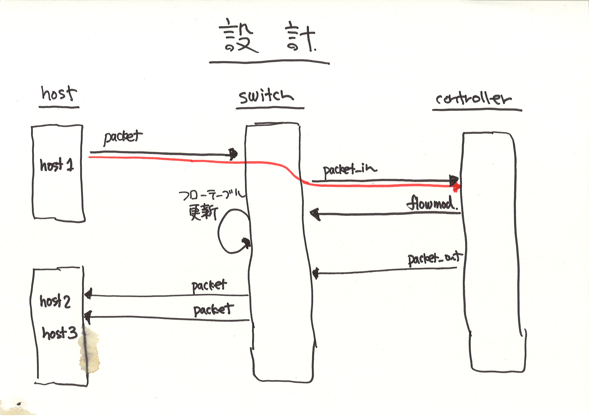

!SLIDE master
# イテレーション #3 #############################################################
## "Packet-in"

!SLIDE full-page-image

!SLIDE bullets small incremental
# テストの詳細化 ################################################################

* <b>"packet_in メッセージがコントローラに届く"</b>
* ==
* スイッチ 1 台とホストが 3 あったとき (<i>Given</i>)、
* ホスト 1 が ホスト 2 にパケットを送ると (<i>When</i>)、
* コントローラにスイッチからの packet_in が届く (<i>Then</i>)

!SLIDE smaller
# Expectation ##################################################################

	@@@ ruby
	describe RepeaterHub do
	  it "should receive a packet_in message" do
	    network {
	      # ...
	    }.run(RepeaterHub) {
	      # スイッチ 0xabc から packet_in メッセージが一度だけ届くはず
	      controller("RepeaterHub").should_receive(:packet_in).with do |dpid, m|
	        dpid.should == 0xabc
	      end

	      send_packets "host1", "host2"
	    }
	  end
	end
	
	# => SUCCESS

!SLIDE bullets small
# メッセージハンドラ ############################################################

* Controller#packet_in(datapath_id, message)
* Controller#flow_removed(datapath_id, message)
* Controller#switch_disconnected(datapath_id)
* Controller#port_status(datapath_id, message)
* Controller#stats_reply(datapath_id, message)
* Controller#openflow_error(datapath_id, message)
* src/examples/dumper.rb を参照

!SLIDE smaller
# Don't Repeat Yourself ########################################################

	@@@ ruby
	describe RepeaterHub do
	  around do |example|  # 共通処理をここに書く
	    network {
	      ...
	    }.run(RepeaterHub) {
	      example.run  # テストの実行
	    }
	  end
	
	  it "should #packet_in" do
	    controller("RepeaterHub").should_receive(:packet_in).with do |m, dpid|
	      dpid.should == 0xabc
	    end
	
	    send_packets "host1", "host2"
	  end
	
	  it "should flood incoming packets to every other port" do
	    send_packets "host1", "host2"
	
	    pending( "あとで実装する" )
	    vhost("host2").stats(:rx).should have(1).packets
	    vhost("host3").stats(:rx).should have(1).packets
	  end
	end
		
	# => SUCCESS

!SLIDE full-page-image

!SLIDE full-page-image

