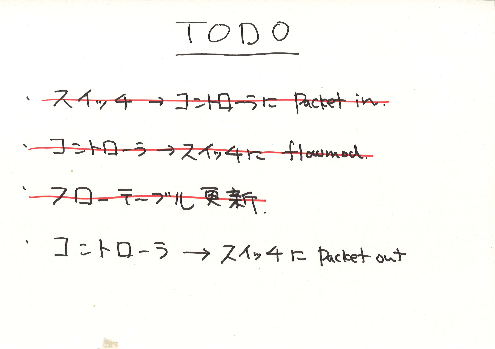

!SLIDE master
# イテレーション #4 #############################################################
## "Flow-mod"

!SLIDE full-page-image

!SLIDE bullets small incremental
# テストの詳細化 ################################################################

* <b>"コントローラが flow_mod を打つ"</b>
* ==
* スイッチ 1 台とホストが 3 あったとき (<i>Given</i>)、
* ホスト 1 が ホスト 2 にパケットを送ると (<i>When</i>)、
* コントローラがスイッチに flow_mod を打つ (<i>Then</i>)

!SLIDE smaller
# わざと失敗 ###################################################################

	@@@ ruby
	it "should send a flow_mod message" do
	  controller("RepeaterHub").should_receive(:send_flow_mod_add).with(0xabc)
		
	  send_packets "host1", "host2"
	end
	
	# => FAIL!

!SLIDE small
# flow-mod を打つ ##############################################################

	@@@ ruby
	class RepeaterHub < Trema::Controller
	  def packet_in datapath_id, message
	    # 空の flow_mod (マッチ無し、アクション無し)
	    send_flow_mod_add datapath_id
	  end
	end
	
	# => SUCCESS

!SLIDE small
# デフォルト引数 ################################################################

## 最初からたくさん書かなくていいためのデフォルト値

	@@@ ruby
	# デフォルトでマッチ無し、アクション無し
	send_flow_mod_add datapath_id
	
	# マッチを指定
	send_flow_mod_add datapath_id, :match => match1
	
	# アクションも指定
	send_flow_mod_add datapath_id,
	                  :match => match1, :actions => [act1, act2]
	
	# idle_timeout も指定 (デフォルト = 0)
	send_flow_mod_add datapath_id,
	                  :idle_timeout = 60,
	                  :match => match1, :actions => [act1, act2]

## 詳しくは Trema Ruby API を参照

!SLIDE small
# フローエントリ数を確認 ########################################################

	@@@ ruby
	# テスト対象はスイッチ
	describe "switch" do
	  it "should have one flow entry" do
	    send_packets "host1", "host2"

	    switch("switch").should have(1).flows
	  end
	end
	
	# => SUCCESS

!SLIDE small
# フローエントリの中身を確認 #####################################################

	@@@ ruby
	describe "switch" do
	  it "should have one flow entry" do
	    send_packets "host1", "host2"

	    switch("switch").should have(1).flows
	    switch("switch").flows.first.actions.should == "FLOOD"
	  end
	end
	
	# => FAIL
	#
	#  1) RepeaterHub switch should have one flow entry
	#     Failure/Error: switch("switch").flows.first.actions.should == "FLOOD"
	#       expected: "FLOOD"
	#            got: "drop" (using ==)

!SLIDE smaller
# アクションを指定する ##########################################################

	@@@ ruby
	def packet_in message
	  send_flow_mod_add(
	    message.datapath_id,
	    :actions => ActionOutput.new(OFPP_FLOOD)
	  )
	end
	
	# => FAIL
	#  1) RepeaterHub should send a flow_mod message
	#     Failure/Error: network {
	#       #<RepeaterHub:0xb7420d94> received :send_flow_mod_add with unexpected arguments
	#         expected: (2748)
	#              got: (2748, {:actions=>#<Trema::ActionOutput:0xb741a368 @port=65531>})

!SLIDE smaller
# 壊れたテストの修正 ############################################################

	@@@ ruby
	it "should send a flow_mod message" do
	  controller("RepeaterHub").should_receive(:send_flow_mod_add)
	                           .with(0xabc, hash_including(:actions))
		
	  send_packets "host1", "host2"
	end
	
	# => SUCCESS

!SLIDE smaller
# フローエントリの中身を確認 #####################################################

	@@@ ruby
	  vhost("host1") { promisc "on"; ip "192.168.0.1" }
	  vhost("host2") { promisc "on"; ip "192.168.0.2" }
	  vhost("host3") { promisc "on"; ip "192.168.0.3" }
	  # ...
	
	describe "switch" do
	  it "should have one flow entry" do
	    send_packets "host1", "host2"

	    switch("switch").should have(1).flows
	    flow = switch("switch").flows.first
	    flow.actions.should == "FLOOD"
	    flow.nw_src.should == "192.168.0.1"
	    flow.nw_dst.should == "192.168.0.2"
	  end
	end
	
	# => FAIL
	#
	#  1) RepeaterHub switch should have one flow entry
	#     Failure/Error: flow.nw_src.should == "192.168.0.1"
	#       expected: "192.168.0.1"
	#            got: nil (using ==)

!SLIDE small
# マッチ構造体を設定 ############################################################

	@@@ ruby
	class RepeaterHub < Trema::Controller
	  def packet_in datapath_id, message
	    send_flow_mod_add datapath_id,
	                      :match => ExactMatch.from(message),
	                      :actions => ActionOutput.new(OFPP_FLOOD)
	  end
	end
	
	# => SUCCESS

!SLIDE small
# ExactMatch.from() ############################################################

	@@@ ruby
	ExactMatch.from(message)
	
	# vs.
	
	Match.new(
	  :in_port = message.in_port,
	  :nw_src => message.nw_src,
	  :nw_dst => message.nw_dst,
	  :tp_src => message.tp_src,
	  :tp_dst => message.tp_dst,
	  :dl_src => message.dl_src,
	  :dl_dst => message.dl_dst,
	    ...
	)	      	

!SLIDE full-page-image

!SLIDE full-page-image

