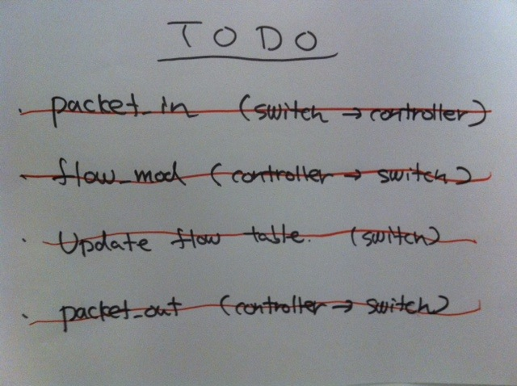
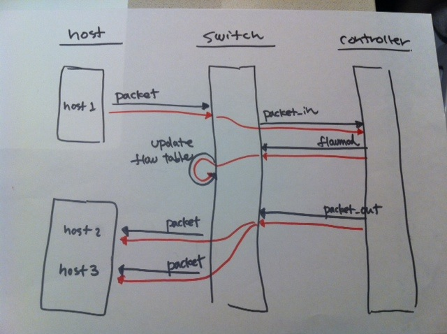

!SLIDE master
# イテレーション #5 #################################################################
## "Packet-out"

!SLIDE small
# すべてのホストにパケットが届く? #########################################################

## pending にしていたテストを復活

	@@@ ruby
	describe "host" do
	  it "should flood incoming packets to every other port" do
	    send_packets "host1", "host2"
	
	    vhost("host2").stats(:rx).should have(1).packets
	    vhost("host3").stats(:rx).should have(1).packets
	  end
	end
	
	# => FAIL!

!SLIDE smaller
# パケットアウトしよう #################################################################

	@@@ ruby
	class RepeaterHub < Trema::Controller
	  def packet_in datapath_id, message
	    send_flow_mod_add(
	      datapath_id,
	      :match => ExactMatch.from(message),
	      :actions => Trema::ActionOutput.new(OFPP_FLOOD)
	    )
	    send_packet_out( # 追加
	      datapath_id,
	      :packet_in => message,
	      :actions => Trema::ActionOutput.new(OFPP_FLOOD)
	    )
	  end
	end
	
	# => SUCCESS

!SLIDE small
# パケットアウト API ################################################################

	@@@ ruby
	send_packet_out(
	  datapath_id,
	  :packet_in => message,
	  :actions => Trema::ActionOutput.new(OFPP_FLOOD)
	)
	
	# vs.

	send_packet_out(
	  datapath_id,
	  :data => message.buffered? ? nil : message.data,
	  :in_port => message.in_port,
	  :buffer_id => message.buffer_id,
	  :actions => Trema::ActionOutput.new(OFPP_FLOOD)
	)

!SLIDE full-page-image

!SLIDE full-page-image

!SLIDE master
# できた! (?) ####################################################################
